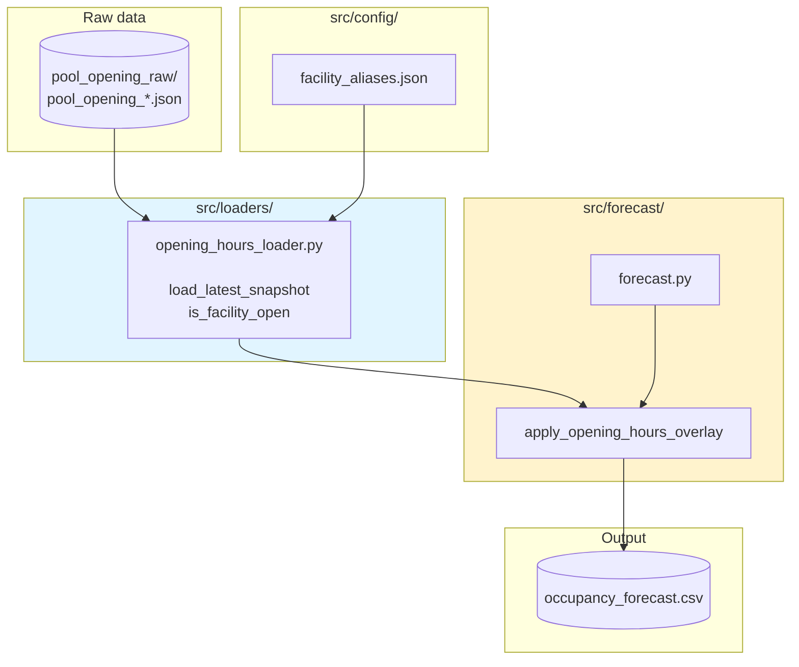
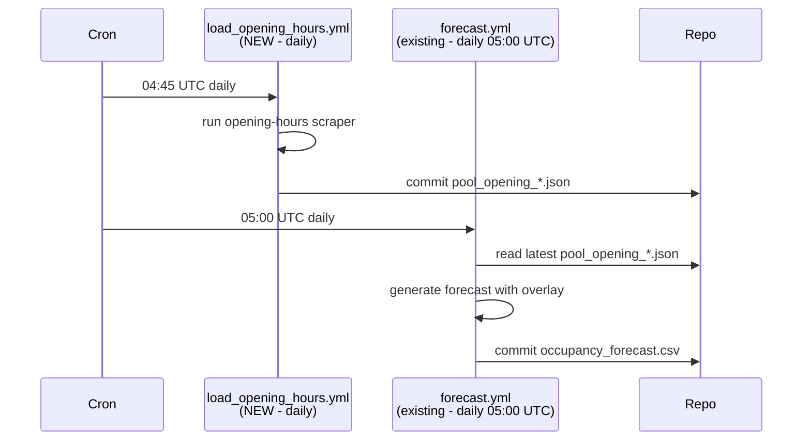

# Architecture: Integrate Opening Hours

Read [proposal.md](./proposal.md) and [domain.md](./domain.md) first.

## Technical approach

Treat opening hours as a **deterministic overlay** applied after the ML model
runs. The model's job is unchanged — predict `occupancy_percent` for every
hour, facility, and weather combination. The overlay then replaces predicted
values on hours the facility is scheduled closed. No retraining, no feature
engineering, no model changes.

This mirrors the pattern already used for holidays and school vacations: a
lightweight loader provides a lookup function, and a pure Python step in the
pipeline consumes it.

## Component overview



## Data format: `pool_opening_*.json`

Follows the shape of existing scrape JSON files (see
`pool_scrapes_raw/pool_data_*.json`) for familiarity. Proposed schema:

```json
{
  "scrape_timestamp": "2026-01-16T18:08:36.000000+01:00",
  "scrape_metadata": {
    "total_facilities": 13,
    "method": "web"
  },
  "facilities": [
    {
      "facility_name": "Olympia-Schwimmhalle",
      "facility_type": "pool",
      "source_url": "https://www.swm.de/baeder/olympia-schwimmhalle#oeffnungszeiten",
      "weekly_schedule": {
        "monday":    [{"open": "07:00", "close": "22:30"}],
        "tuesday":   [{"open": "07:00", "close": "22:30"}],
        "wednesday": [{"open": "07:00", "close": "22:30"}],
        "thursday":  [{"open": "07:00", "close": "22:30"}],
        "friday":    [{"open": "07:00", "close": "22:30"}],
        "saturday":  [{"open": "08:00", "close": "20:00"}],
        "sunday":    [{"open": "08:00", "close": "20:00"}]
      }
    }
  ]
}
```

**Design choices:**

- **Weekly pattern only.** No date-specific overrides — keeps scope tight
  (see [proposal.md](./proposal.md#scope)).
- **Weekday names as keys** match the keys produced by Python's `strftime`
  (`%A`) and are more readable than integers when inspecting the file.
- **Array of intervals per day** supports facilities with midday closures
  without a schema change later.
- **Times as `HH:MM` strings** in Berlin local time — same convention as
  `holidays/school_holidays.json`.
- **`facility_name` and `facility_type`** keyed exactly like the other raw
  data; the loader resolves aliases via the existing
  `src/config/facility_aliases.json`.

## Loader API

New file: `src/loaders/opening_hours_loader.py`

```python
def load_latest_snapshot(input_dir: Path, aliases: dict) -> dict:
    """Return {(facility_type, facility_name): weekly_schedule} from the most
    recent pool_opening_*.json. Applies alias resolution."""

def is_facility_open(
    schedules: dict,
    facility_type: str,
    facility_name: str,
    dt: datetime,
) -> bool | None:
    """True/False if schedule known. None if facility missing from snapshot."""
```

Returning `None` (not `True`) for unknown facilities preserves today's
behavior: the forecast still emits a prediction and a warning, rather than
silently hiding a facility the model knows about. See
[proposal.md](./proposal.md#success-criteria) point 2.

## Overlay semantics

Pseudocode for the forecast step, replacing the end of
`generate_forecasts` in `src/forecast/forecast.py`:

```python
is_open_now = is_facility_open(
    schedules, facility_type, facility_name, ts_tz,
)

if is_open_now is False:
    prediction = 0.0
    is_open_value = 0
elif is_open_now is True:
    is_open_value = 1
else:  # None -> unknown facility
    is_open_value = "NULL"
    logger.warning(f"No opening hours known for {facility_type}:{facility_name}")
```

| `is_open_now` | `is_open` in CSV | `occupancy_percent` |
|---------------|------------------|---------------------|
| `True`        | `1`              | model prediction    |
| `False`       | `0`              | `0.0`               |
| `None`        | `NULL`           | model prediction    |

Historical CSV semantics are unchanged (`is_open` observed from the scraper).
Only the forecast CSV is touched.

## Workflow integration



The new workflow runs **before** the existing daily forecast so overlay data
is fresh. If the opening-hours scraper fails, the forecast still runs using
whatever snapshot was committed most recently — the system degrades
gracefully rather than blocking.

## Key decisions and tradeoffs

**Deterministic overlay vs. model feature**

- *Chosen:* deterministic overlay.
- *Rejected:* adding `is_scheduled_open` as a model feature.
- *Why:* the rule is known and perfect; the model would only dilute signal by
  re-learning it. Simpler pipelines are easier to debug.

**One consolidated JSON vs. one file per facility**

- *Chosen:* one JSON file per scrape run, all facilities inside.
- *Why:* matches `pool_data_*.json` convention. Fewer files to commit, easier
  to diff day-over-day to spot schedule changes.

**Weekly pattern vs. per-date schedule**

- *Chosen:* weekly pattern only.
- *Tradeoff:* public holidays and ad-hoc closures will not show as closed in
  the forecast. Holidays are already a model feature, so the model itself
  has some signal. Ad-hoc closures are rare and out of scope
  ([proposal.md](./proposal.md#scope)).

**`occupancy_percent = 0` vs. `NULL` for closed hours**

- *Chosen:* `0`.
- *Why:* the historical CSV has no `NULL` values in this column, and
  downstream consumers (plots, averages) handle `0` naturally. `is_open = 0`
  is the machine-readable signal that the value is a sentinel, not a
  prediction.

## Integration points and files affected

| File | Change |
|------|--------|
| `src/loaders/opening_hours_loader.py` | NEW |
| `pool_opening_raw/` | NEW directory |
| `src/forecast/forecast.py` | Import loader; apply overlay in `generate_forecasts` |
| `.github/workflows/load_opening_hours.yml` | NEW |
| `.github/workflows/forecast.yml` | Adjust schedule / dependency ordering if needed |
| `README.md` | Document new data stream |
| `Specs/03_FORECAST_FILE_FORMAT.md` | Update `is_open` semantics for forecast rows |
| `CLAUDE.md` | Add opening-hours file location to project overview |

Deliberately **not touched**:

- `src/transform.py` — opening hours never enter the historical CSV.
- `src/train/train.py` — no new features.
- `models/occupancy_model.pkl` — model stays as-is.

## Risks

1. **Schedule scraping fragility.** If the swm.de HTML changes, the scraper
   stops producing snapshots. Mitigation: loader falls back to the most
   recent valid snapshot and logs a warning; the pipeline does not fail.
2. **Facility-name drift.** A renamed pool won't match the snapshot. The
   existing alias system (`04_ADAPT_TO_FACILITY_NAME_CHANGE.md`) is the fix
   — the loader must use it.
3. **Multi-interval days.** If SWM publishes morning+evening hours with a
   midday break, the array-of-intervals schema already supports it, but the
   loader's `is_facility_open` must check all intervals rather than just the
   first.
