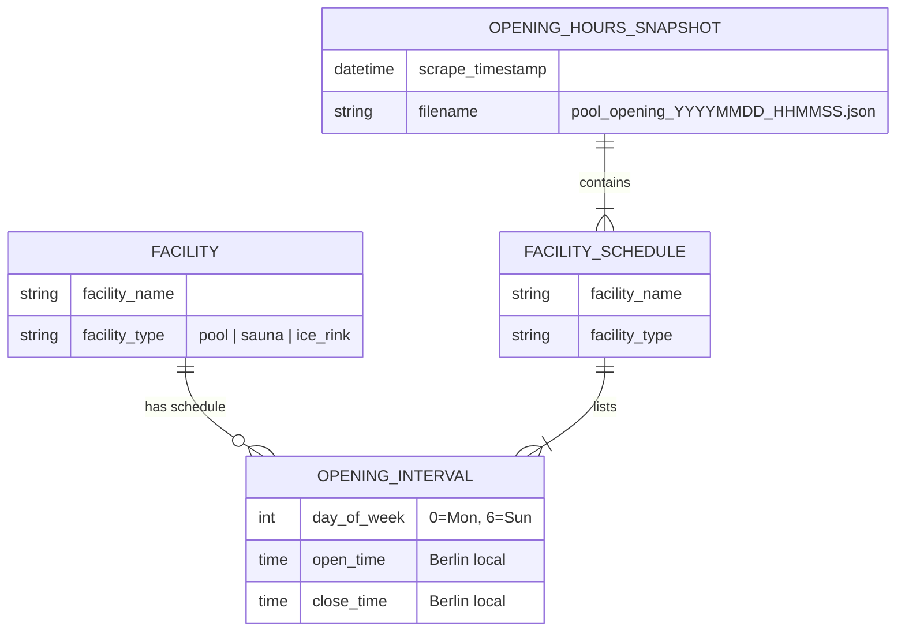
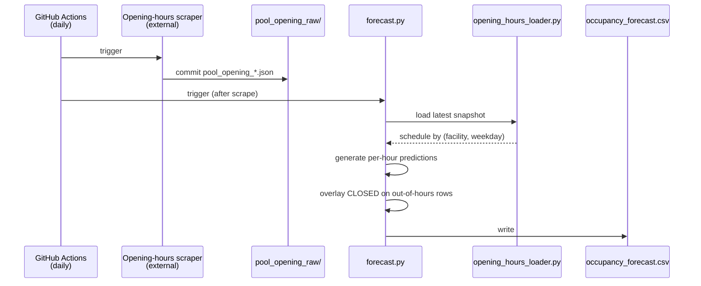

# Domain: Opening Hours

This document captures domain concepts introduced or changed by the
[integrate-opening-hours](./proposal.md) change.

## New concepts

### Opening Hours

The **published schedule** for when a SWM facility is open to the public,
expressed as a weekly pattern (one set of open/close intervals per weekday).
Opening hours are a **facility attribute**, not an observation — they describe
the facility's intent, not what happened.

Each facility has its own opening-hours page on swm.de. The URL is expected to
follow the pattern:

```
https://www.swm.de/baeder/<facility-slug>#oeffnungszeiten
```

The exact URL scheme (slug generation, singular/plural, etc.) must be
confirmed when the scraper is implemented. See
[proposal.md](./proposal.md#scope) — the scraper itself is out of scope for
this change.

### Opening Interval

A half-open time range `[open_time, close_time)` during which a facility is
open on a specific weekday. A facility may have multiple intervals per day
(e.g., morning and evening with a midday closure), though in practice most
pools have a single interval.

Times are **Berlin local wall-clock time**, consistent with all other
timestamps in this project
([README.md#timestamp-handling](../../../README.md)).

### Closed Hour

An hour in the forecast horizon that falls entirely **outside** every opening
interval for that facility on that weekday. For closed hours we emit a
deterministic record rather than a model prediction — see
[architecture.md](./architecture.md) for how the overlay is applied.

### Opening Hours Snapshot

A single JSON file produced by one run of the opening-hours scraper, named
`pool_opening_YYYYMMDD_HHMMSS.json`, containing the schedule for **all**
tracked facilities. Scraped once per day — opening hours change rarely, so
sub-daily cadence would be wasteful.

## Changed concepts

### `is_open` in the forecast

**Before:** Always `NULL` in forecast rows — the model cannot predict opening
status, and no deterministic source was available.
([`03_FORECAST_FILE_FORMAT.md`](../../03_FORECAST_FILE_FORMAT.md), row 24.)

**After:** Populated deterministically from the opening-hours snapshot —
`1` when the forecast hour falls inside an opening interval, `0` otherwise.
`NULL` is reserved for the case where no opening-hours data is available for
a facility (graceful fallback).

### `occupancy_percent` in the forecast

**Before:** Always a model prediction, even for hours when the facility is
closed — misleading because training excludes closed rows
(`src/train/train.py:39`).

**After:** When `is_open = 0`, `occupancy_percent = 0`. The model is still the
source of truth for open hours. See
[architecture.md](./architecture.md#overlay-semantics) for the
exact precedence.

## Entities and relationships



## Process: opening-hours lifecycle



## Involved parties

- **SWM (Stadtwerke München)** — authoritative source for the published
  opening-hours web pages.
- **External scraper tool** — analogous to
  [`swm_pool_scraper`](https://github.com/tillg/swm_pool_scraper), scraping
  opening-hours pages. Not part of this repo.
- **This repo's forecast pipeline** — consumer of the opening-hours
  snapshots.

## Assumptions

- Opening hours **rarely change**. Daily scraping is sufficient; the pipeline
  does not need to react faster than a day.
- The **published** schedule is the effective schedule. Ad-hoc closures
  (maintenance, special events) are not captured and will show up as
  `is_open = 1` in the forecast — see [proposal.md](./proposal.md#scope).
- Schedule is a **weekly pattern**, not date-specific. A Tuesday in January
  and a Tuesday in July use the same intervals unless the snapshot itself
  differs.
