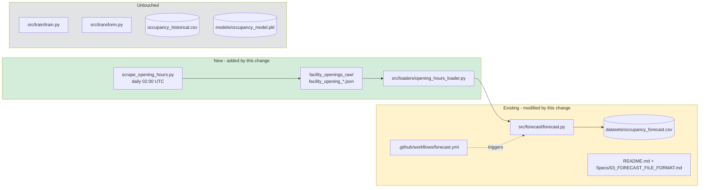

# Integrate Pool Opening Hours

**Status:** Proposed
**Change name:** `integrate-opening-hours`

## Summary

Add a new data source that records each facility's scheduled opening hours, and
use it to mark forecast rows as `CLOSED` when the facility is outside those
hours. The ML model continues to predict occupancy only for open hours; closed
hours are filled deterministically in a post-processing step.

## Motivation

Today `datasets/occupancy_forecast.csv` emits `is_open = NULL` for every future
hour, and the model predicts an `occupancy_percent` value regardless of whether
the pool is actually open. That is misleading: a sauna predicted at "40% free"
at 03:00 implies it might be visitable, when in fact it is closed.

Training already excludes rows where `is_open == 0` (see
`src/train/train.py:39`), so the model has never learned closed-hour behavior —
yet its predictions are shown for those hours anyway. Users inspecting the
forecast cannot distinguish "model thinks it will be busy" from "facility is
not open at all".

Opening hours change rarely (a few times per year at most), so learning them
from history is unnecessary complexity. A daily snapshot of the published
opening hours, applied as a deterministic overlay on the forecast, gives the
right answer with far less machinery than a second model.

## Scope

**In scope**

- A new scraped data stream for opening hours (see
  [`04_ADAPT_TO_FACILITY_NAME_CHANGE.md`](../../04_ADAPT_TO_FACILITY_NAME_CHANGE.md)
  for the facility-alias conventions this must respect).
- Storage of raw opening-hours JSON in a new `facility_openings_raw/`
  directory, one file per scrape (filename pattern:
  `facility_opening_YYYYMMDD_HHMMSS.json`).
- A daily workflow (`load_opening_hours.yml`) that invokes the upstream
  `swm_pool_scraper` — `scrape_opening_hours.py` — and commits the JSON.
- Integration into the forecast pipeline so `is_open` and `occupancy_percent`
  reflect the known schedule.
- Documentation updates (README, forecast file format spec).

**Status as of 2026-04-20:** the workflow and raw directory are in place
(wired via guide from the scraper author). ML-pipeline integration
— loader + forecast overlay — is still pending.

**Out of scope**

- Teaching the ML model about opening hours directly. The model's feature set
  stays as-is.
- Backfilling historical `is_open` values in `occupancy_historical.csv`. Those
  are already observed directly from the scraper and are trustworthy.
- Handling of ad-hoc closures (maintenance, holidays, events). This change
  only models the regular weekly schedule. Ad-hoc closures may still appear
  incorrectly as "open" in the forecast; that is an accepted limitation.
- The scraper implementation itself. Like the existing pool/weather scrapers,
  it is assumed to exist as an external tool that produces the JSON files.

## Expected Outcome

- `datasets/occupancy_forecast.csv` rows during closed hours have
  `is_open = 0` and `occupancy_percent = 0` (or another sentinel — decided in
  architecture.md).
- `facility_openings_raw/` contains one JSON file per daily scrape, in the
  same style as `pool_scrapes_raw/` and `weather_raw/`.
- A new loader module reads the most recent opening-hours JSON and exposes a
  simple `is_facility_open(facility_name, facility_type, dt) -> bool` helper.
- The forecast workflow runs after the opening-hours workflow so the overlay
  uses fresh data.

## Impact Scope

## Success Criteria

1. For any hour on the forecast horizon where the facility is scheduled
   closed, the corresponding CSV row has `is_open = 0` and
   `occupancy_percent = 0`.
2. Adding or removing a pool from the opening-hours JSON does not break the
   forecast pipeline (graceful fallback: unknown facilities default to "open"
   with a warning, matching today's behavior).
3. The opening-hours loader uses the same facility-alias resolution as the
   existing pipeline, so renames are handled centrally.
