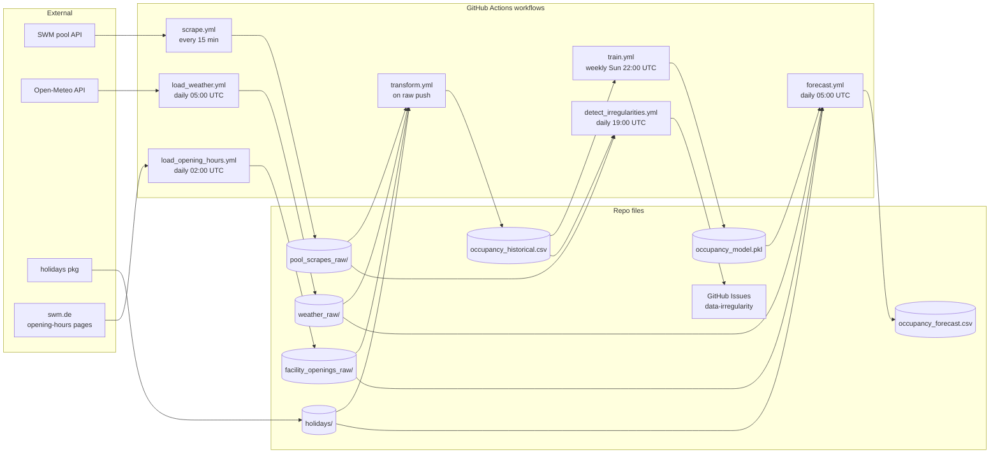

# System Architecture

The technical realization of the domain described in
[domain.md](./domain.md). Proposals for changes live under
[`../changes/`](../changes/).

## Top-level view

Five independent GitHub Actions workflows, each producing files committed
back to this repo. No long-running services, no databases — just JSON/CSV
snapshots in the git tree. This keeps the system debuggable,
reproducible, and free to operate.



All workflows are in production. Opening hours flow through both
`transform.py` (historical overlay) and `forecast.py` (forecast overlay)
so the deterministic schedule applies on both sides of the unified CSV.

## Repository layout

```
swm_pool_data/
├── .github/workflows/               # Pipeline orchestration
│   ├── scrape.yml                   # Triggers transform via workflow_call
│   ├── load_weather.yml             # Path-triggers transform via push
│   ├── transform.yml                # Produces historical CSV
│   ├── train.yml                    # Produces model
│   ├── forecast.yml                 # Produces forecast CSV
│   └── detect_irregularities.yml    # Opens data-irregularity issues
├── pool_scrapes_raw/                # Raw occupancy snapshots (JSON per scrape)
├── weather_raw/                     # Raw weather snapshots (JSON per day)
├── holidays/                        # public_holidays.json, school_holidays.json
├── datasets/                        # ML-ready output
│   ├── occupancy_historical.csv
│   └── occupancy_forecast.csv
├── models/
│   └── occupancy_model.pkl          # LightGBM booster (pickled)
├── facility_openings_raw/           # Daily opening-hours snapshots
├── src/
│   ├── config/
│   │   ├── facility_aliases.json    # Canonical name overrides
│   │   └── facility_types.json      # Auto-generated name→type map
│   ├── loaders/
│   │   ├── weather_loader.py        # Open-Meteo fetcher
│   │   ├── holiday_loader.py        # Holiday lookup helpers
│   │   └── opening_hours_loader.py  # Schedule snapshot + is_facility_open()
│   ├── checks/                      # Irregularity watchdogs
│   ├── train/                       # train.py + hyperparameters.py
│   ├── forecast/forecast.py
│   ├── tests/                       # Pytest suite
│   └── transform.py                 # Compiles raw → historical CSV
└── Specs/                           # This documentation
    ├── system/                      # What the system IS (this folder)
    └── changes/                     # Proposed or implemented changes
```

## Components and responsibilities

### Raw data layer

| Directory | Producer | Cadence | Format |
|-----------|----------|---------|--------|
| `pool_scrapes_raw/` | External pool scraper (scrape.yml) | ~15 min | `pool_data_YYYYMMDD_HHMMSS.json` |
| `weather_raw/` | `weather_loader.py` (load_weather.yml) | daily | `weather_YYYYMMDD.json` (Open-Meteo hourly) |
| `holidays/` | `holiday_loader.py` + manual | rare | `public_holidays.json`, `school_holidays.json` |
| `facility_openings_raw/` | External opening-hours scraper (load_opening_hours.yml) | daily 02:00 UTC | `facility_opening_YYYYMMDD_HHMMSS.json` |

**Contract:** raw files are immutable once committed. The transform layer
reads them; nothing else mutates them.

### Transform: raw → historical CSV

`src/transform.py` performs an **incremental** merge:

1. Read `datasets/occupancy_historical.csv` if present; note the latest
   timestamp.
2. Load pool snapshots strictly newer than that timestamp.
3. Apply facility-alias resolution.
4. Join with weather snapshots on Berlin-local-hour.
5. Attach `is_holiday` and `is_school_vacation` flags.
6. Validate (occupancy in [0, 100], dedupe on
   `(timestamp, facility_name, facility_type)`).
7. Apply the **deterministic opening-hours overlay** to the whole
   combined frame: rows whose `(facility, weekday, hour)` falls outside
   the published schedule get `is_open=0` and `occupancy_percent=0.0`;
   rows inside the schedule get `is_open=1`. Rows for facilities
   missing from the snapshot are left untouched. The overlay is
   idempotent and rewrites the entire CSV each run, so the historical
   backlog stays consistent with the latest schedule.
8. Append (validated + overlaid) to the historical CSV and regenerate
   `src/config/facility_types.json`.

The scraper's reported `is_open` is unreliable (always `true` even at
03:00), so the published schedule is the source of truth on both sides
of the pipeline.

Trigger: `transform.yml` runs on `workflow_call` from `scrape.yml` and on
path-push from `weather_raw/`.

### Training: historical CSV → model

`src/train/train.py` trains a **single LightGBM booster** with `facility`
as a categorical feature. Training filters to `is_open == 1` only —
closed-hour behavior is handled outside the model. Time-based split (last
10% as validation). See
[forecast-ml](../changes/forecast-ml/proposal.md).

Trigger: `train.yml` runs weekly (Sunday 22:00 UTC).

### Forecast: model → forecast CSV

`src/forecast/forecast.py` produces a 48-hour prediction window starting
from the current hour, one row per (hour × facility). For each hour it
reads the Open-Meteo forecast for the matching Berlin-local-hour, builds
the model's feature vector, and calls `model.predict`.

Forecast and historical CSVs share an identical schema. After model
prediction, the same deterministic opening-hours overlay used by
`transform.py` is applied: closed hours emit `is_open=0` and
`occupancy_percent=0.0`; unknown facilities (missing from the snapshot)
emit `is_open="NULL"` and a one-off warning. The overlay reuses
`src/loaders/opening_hours_loader.py` and the latest
`facility_opening_*.json`.

Trigger: `forecast.yml` runs daily (05:00 UTC), three hours after the
opening-hours scraper so the snapshot is fresh.

### Irregularity watchdog

`src/checks/` contains two independent scripts — one reads
`pool_scrapes_raw/`, one reads the historical CSV — and each emits a
GitHub issue labeled `data-irregularity` when it spots anomalies
(missing/new facilities, capacity drift, stuck zeros). See
[data-irregularities](../changes/data-irregularities/proposal.md).

Trigger: `detect_irregularities.yml` runs daily (19:00 UTC).

## Cross-cutting concerns

### Timezone handling

Every timestamp entering the system is converted to Berlin local time
first, then stored as ISO 8601 with an explicit offset. Inside Python, we
use timezone-naive pandas timestamps representing Berlin local time — this
lets us join weather and pool data on wall-clock hour without wrestling
with DST-transition ambiguities. Parsing always goes through
`pd.to_datetime(..., utc=True).dt.tz_convert("Europe/Berlin")` to safely
handle mixed `+01:00` / `+02:00` offsets in the same file.

Full rules: [README.md → Timestamp Handling](../../README.md).

### Facility identity

- The pair `(facility_type, facility_name)` is the unique key.
- Raw files may contain legacy names; aliases in
  `src/config/facility_aliases.json` (keyed `type:name`) resolve them.
- `src/config/facility_types.json` is a **derived** mapping regenerated by
  each transform run — consumers (like `forecast.py`) read it to learn the
  current facility set.

### Trigger graph and concurrency

GitHub Actions will not cascade workflows triggered by the default
`GITHUB_TOKEN`. Consequences:

- `scrape.yml` calls `transform.yml` via `workflow_call`, not via push
  event.
- `transform.yml` uses a concurrency group with `cancel-in-progress: true`
  so that only the latest data is processed when bursts arrive.

### File naming conventions

| Purpose | Pattern |
|---------|---------|
| Raw pool snapshot | `pool_data_YYYYMMDD_HHMMSS.json` |
| Raw weather snapshot | `weather_YYYYMMDD.json` |
| Raw opening hours | `facility_opening_YYYYMMDD_HHMMSS.json` |
| Historical dataset | `datasets/occupancy_historical.csv` |
| Forecast dataset | `datasets/occupancy_forecast.csv` |
| Trained model | `models/occupancy_model.pkl` |

## Deployment model

- **No servers.** All compute happens on GitHub-hosted runners.
- **State lives in git.** Every dataset, model, and raw file is a committed
  artifact; history is the audit log.
- **No secrets required** for the core pipeline (all upstream APIs are
  public/free).

## Extensibility points

- **New data source:** add a loader under `src/loaders/`, a raw directory,
  and a workflow. Integrate into `transform.py` (for historical features)
  or `forecast.py` (for forecast-time overlays).
- **New feature for the model:** extend `src/train/hyperparameters.py`
  (`FEATURE_COLUMNS`) and ensure `transform.py` emits the column.
- **New facility type:** no code change — transform picks up any
  `facility_type` value present in raw JSON. Irregularity checks will flag
  the first appearance so a human can confirm.

## Non-goals

- Real-time (sub-15-minute) occupancy.
- Per-user predictions or personalization.
- Backfilling from sources before SWM started publishing live occupancy.
- A hosted dashboard — this repo is a data product, not an application.
