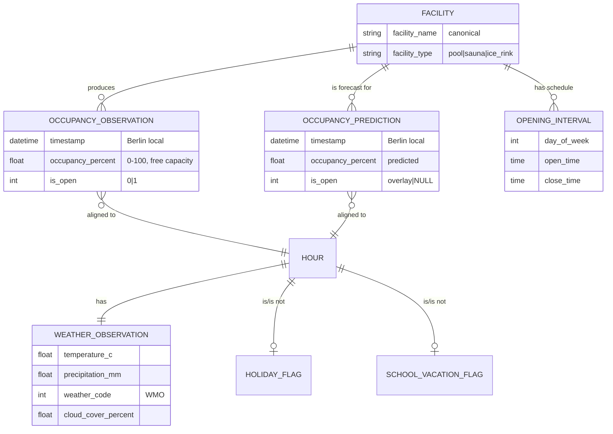
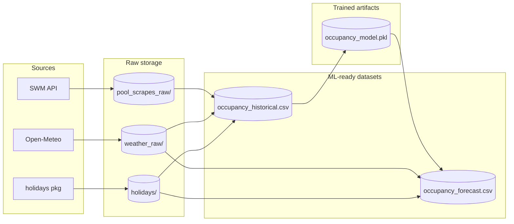

# System Domain

This document describes the domain of the `swm_pool_data` project: the
entities, actors, processes, and invariants that the system models.

For the system's technical realization, see
[architecture.md](./architecture.md). For changes to the domain, see
individual proposals under [`../changes/`](../changes/).

## Purpose

Collect, enrich, and forecast **occupancy** for public recreational
facilities operated by Stadtwerke München (SWM) in Munich — swimming pools,
saunas, and ice rinks. The system produces a continuous historical record and
a rolling 48-hour forecast, both in a single unified CSV schema.

## Actors

| Actor | Role |
|-------|------|
| **SWM (Stadtwerke München)** | Authoritative upstream for live occupancy and opening hours (web + API). |
| **Open-Meteo** | Free weather API — historical and forecast hourly weather for Munich. |
| **`holidays` Python package** | Authoritative for Bavarian public holidays. |
| **Maintainer (manual)** | Authors Bavarian school-vacation JSON from the official calendar. |
| **External scrapers** | Tools that live outside this repo (e.g. [`swm_pool_scraper`](https://github.com/tillg/swm_pool_scraper)) and produce the raw JSON this repo consumes. |
| **GitHub Actions** | Orchestrates the entire pipeline on cron + event triggers. |
| **Downstream consumer** | Reads `occupancy_historical.csv` and `occupancy_forecast.csv` — ML models, dashboards, analyses. |

## Core entities

### Facility

A uniquely-named SWM recreational venue. Facilities are keyed by the
**composite** `(facility_type, facility_name)` — the same display name
(e.g. "Cosimawellenbad") can refer to both a pool and a sauna. Canonical
facility names are enforced by [facility-name-aliases](../changes/facility-name-aliases/proposal.md).

Currently tracked: 7 pools, 6–7 saunas (grew on 2026-01-19), 1 ice rink.

### Occupancy observation

A single scrape reading: "at time *t*, facility *F* has *X%* free capacity and
is currently *open/closed*". Scraped roughly every 15 minutes — see
[datasets-frequency](../changes/datasets-frequency/proposal.md).

**Free capacity** (percentage free), not utilization. 100% means empty, 0%
means full. This is a deliberate SWM convention kept as-is.

### Occupancy prediction

A model output: "at time *t* (in the next 48 hours), facility *F* is expected
to have *X%* free capacity". Uses the same schema as an observation and is
distinguished by the `data_source` column — see
[forecast-file-format](../changes/forecast-file-format/proposal.md).

### Hour

The unit of temporal alignment throughout the system. All timestamps are
floored to the hour for joining with weather. Hours are **Berlin local**
(CET / CEST); see [Time](#time) below.

### Weather observation

Hourly temperature, precipitation, WMO weather code, and cloud cover for
Munich. Acts as a feature for the model and — during forecast — as the
driver of per-hour predictions.

### Holiday / school-vacation flag

Two independent boolean features per date: `is_holiday` (Bavarian public
holidays) and `is_school_vacation` (Bavarian school-break periods).

### Opening interval

A half-open time range `[open, close)` during which a facility is open on a
given weekday. Introduced by
[integrate-opening-hours](../changes/integrate-opening-hours/proposal.md)
and applied deterministically to the forecast.

## Key processes

### Scrape → Transform → Train → Forecast

Each step is an independent GitHub Actions workflow. Failures are isolated
— a failed scrape does not block the next run.

### Irregularity detection

An out-of-band watchdog process (see
[data-irregularities](../changes/data-irregularities/proposal.md)) opens
GitHub issues when upstream data diverges from historical patterns (missing
facilities, new facilities, capacity drift). This is how we first learned of
the 2026-01 sauna rename.

## Time

**Canonical timezone: Europe/Berlin.** Pool usage is driven by local
wall-clock time — people swim "at 10 AM", not at "09:00 UTC". All stored
timestamps carry an explicit Berlin offset (`+01:00` in winter, `+02:00` in
summer). Internal processing converts to timezone-naive Berlin time for
pandas-friendly joins.

Full rules are documented in [README.md → Timestamp Handling](../../README.md).

## Invariants

1. **Unified CSV schema.** `occupancy_historical.csv` and
   `occupancy_forecast.csv` have the **same columns in the same order**, and
   differ only in the `data_source` value.
2. **Composite facility identity.** Every row can be keyed by
   `(facility_type, facility_name)`; the same display name may appear
   under different types.
3. **Canonical names only.** Downstream datasets never contain legacy names
   from before an alias was added. The alias table in
   `src/config/facility_aliases.json` is the single source of truth.
4. **Timestamps carry timezone.** Every persisted timestamp is ISO 8601 with
   offset. Timezone-naive timestamps exist only inside Python during
   processing.
5. **Training excludes closed hours.** `is_open == 1` is the training
   filter; the model has no closed-hour knowledge. Closed-hour forecast
   values come from a deterministic overlay, not the model.
6. **Raw is immutable.** Raw JSON files are only appended, never mutated.
   Reprocessing is always possible from raw.

## Glossary

| Term | Meaning |
|------|---------|
| Facility | A pool, sauna, or ice rink operated by SWM. |
| `occupancy_percent` | Percentage of capacity **free** (0 = full, 100 = empty). |
| `is_open` | Whether the facility is currently open to visitors (observation) or scheduled to be open (forecast overlay). |
| Canonical name | The current display name of a facility; legacy names are aliased to the canonical. |
| Snapshot | A single-scrape JSON file (pool, weather, or opening hours). |
| Scrape | The act of fetching data from an upstream source and producing a snapshot. |
| Raw | Unprocessed snapshots as committed by scrapers (`pool_scrapes_raw/`, `weather_raw/`, `pool_opening_raw/`). |
| Compiled | The merged ML-ready CSVs under `datasets/`. |
